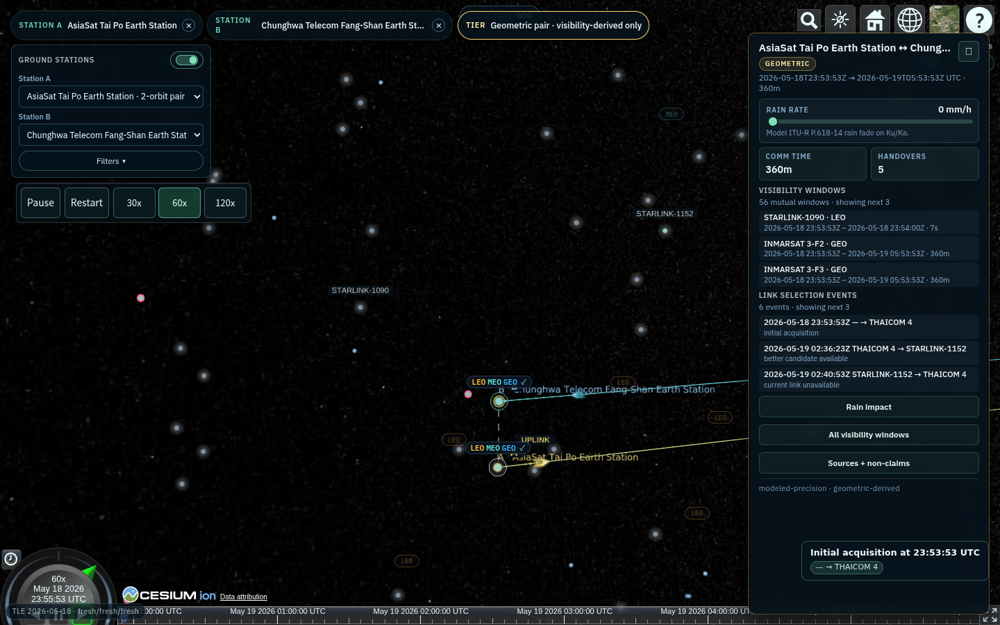
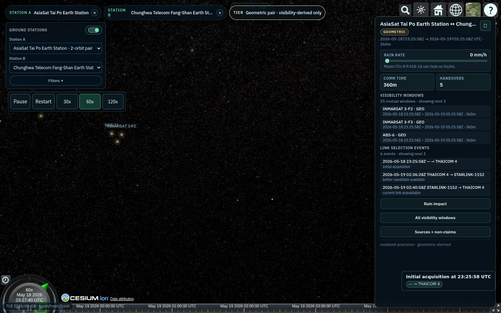

# Selected-pair TLE-first fidelity uplift — wave 2 progress

Date: 2026-05-19  
HEAD after Task 1: `cf4e353`  
Audience: technical reviewers already familiar with the selected-pair route.

Deck shape: front question log + 15 required sections. Numeric claims cite a
commit, SDD section, spike report row, or local code path.

---

# Question Log — Q1

Question: do homepage ground-station dots encode color or size, or are they
uniform?

Answer: not uniform. Source:
`station-markers.ts` + `station-compatibility.ts`.

| Encoding | Normal dot | Highlight / selected |
| --- | --- | --- |
| tri-capable | green, radius 4.5 px; current minority group gets pink outline | green, radius 7 px, yellow outline |
| dual-only / none | blue, radius 3.5 px, dark outline | blue, radius 5.5 px, yellow outline |

Boundary: this is handover-capability + hover/selection encoding only. Source
tier remains in chips, station info card, and the V4 panel.

---

# Question Log — Q2

Question: are there only two dot groups, and does "band" mean frequency band?

Answer: yes, visually two main dot groups. Source:
`station-compatibility.ts`, `marker-filter-chips.ts`,
`marker-band-chips.ts`.

| Term | Meaning |
| --- | --- |
| `tri-capable` | station can form at least one compatible pair with 3 shared handover orbits |
| `dual-only` | station can form compatible pairs, but maxes out at 2 shared handover orbits |
| `none` | no compatible pair; rendered with the blue dual-style dot |
| Orbit filter | filters station support for LEO / MEO / GEO |
| Band filter | RF frequency band filter: Ka, Ku, C, X, S, L |

Current registry capability count: 21 tri-capable, 47 dual-only, 1 none.

---

# Wave-2 Scope

Master SDD: `docs/sdd/multi-station-selector/tle-first-fidelity-uplift.md`.
Source anchors: SDD §7, §11, §12.1; 42-gap roll-up in SDD §14.

Wave 2 decomposes:

| Input | Delivery shape |
| --- | --- |
| 42 audit gaps | Slices F1-F8 |
| 8 visual-evidence gaps | Slice F9 |
| Data/legal/perf unknowns | Spikes S1, S2a, S2b, S3 |

Status at `cf4e353`: F1, F7, F6 prep, S1, slice-0 baseline, and the
Task-1 framing regression fix landed. F2/F3/F4/F5 remain gated by
S2a/S2b/S3.

---

# Architecture Contract

Source: SDD §4.1 + §5.1.

| RF term | Truth boundary |
| --- | --- |
| `tx-eirp` | modeled or unavailable pending S2a |
| `free-space-path-loss` | TR 38.811 §6.6.2 |
| `gas-absorption` | P.676-13 Annex 2 |
| `atmospheric-composite` | P.618-14 §2.4 eq. 65 |
| `rx-antenna-gain` | S.465-6 within range |

Formula:

```text
P_rx = EIRP - FSPL - A_gas
     - sqrt((A_rain + A_cloud)^2 + A_scint^2)
     + G_rx
```

Null rule: any null term forces `receivedPowerProxyDbm = null`; partial sums are forbidden.

---

# What Landed



Screenshot captured after `cf4e353`.

- ✓ SDD v3 + F9 visual layer: `7c44d60`
- ✓ F1 data shape: `db018a6`
- ✓ F7 live TLE + manifest + SATCAT summary: `c6d731d`
- ✓ F6 prep registry fields: `39733a7`
- ✓ slice-0 §6.2 baseline: `ecbe41c`
- ✓ S1 perf spike + SDD closure: `83ed47d`, `714ddec`
- ✓ AsiaSat Tai Po ↔ CHT Fangshan camera fix: `cf4e353`

---

# F1 Highlights

Source: SDD §7 F1, commit `db018a6`, D6 smoke.

- 12 gaps closed.
- New `visibility-cadence-multi.ts` wrapper.
- Per-output `inputSummary`, NORAD + COSPAR exposure, max-epoch freshness.
- Dynamic display transforms now echo the live camera hint.

Before / after shape:

```ts
// before
displayTransforms: ["altitude", "camera", "labels"]

// after
displayTransforms: [{
  sourceId: "selected-pair-scene-camera-framing",
  inputSummary: { pairGeometry, suggestedAltitudeKm,
                  suggestedHeadingDeg, suggestedPitchDeg }
}]
```

---

# F7 Highlights

Source: SDD §7 F7, commit `c6d731d`.

- `scripts/refresh-tle.mjs` downloads CelesTrak GP snapshots for LEO/MEO/GEO.
- `manifest.json` selects one explicit mode:
  `local-snapshot`, `network-snapshot`, or `fallback-local-snapshot`.
- `scripts/refresh-satcat.mjs` reduces SATCAT from ~5 MB CSV to ~250 KB
  summary, per SDD §7 F7.
- Retained SATCAT fields: NORAD id, object name, operator family, constellation, orbit class, decay date.
- Attribution is exposed through the TLE chip and Row 5 source disclosure.

No runtime hot-path network fetch is introduced.

---

# F6 Prep Highlights

Source: SDD §7 F6, commit `39733a7`.

The registry now carries station precision fields for all 69 stations:

| Field | Meaning |
| --- | --- |
| `elevationM` | DEM-derived station height |
| `terrainMaskDeg` | single-value horizon mask, default `0` |

Build-time support:

- `scripts/refresh-station-elevation.mjs`
- `public/fixtures/ground-stations/station-elevations-cache.json`

Runtime wiring is still pending: visibility altitude, rain station height, Row 6 precision disclosure, and D6 assertions are F6 wiring work.

---

# Slice-0 §6.2 Baseline

Source: `slice-0-baseline.md` §6.2, commit `ecbe41c`.

Five walkthrough URLs were frozen at commit `7c44d60`.

Baseline captures:

| Surface | Frozen values |
| --- | --- |
| Row 3 | comm time, handover count, dwell |
| Row 4 | event count + first 3 events |
| Row 5 d1 | per-orbit throughput Mbps |
| Row 6 | precision label + source tier |
| TLE health | LEO/MEO/GEO health |
| sourceMode | route source mode |

Purpose: immutable “before” pane for F9 §49 comparison view; it is only the
frozen baseline for a future comparison pane.

---

# S1 Spike Findings

Source: `docs/spike/multi-station-selector/spike-S1-cap-cadence-perf.md`, commit `83ed47d`, SDD closure `714ddec`.

| Config | Result |
| --- | ---: |
| C1: LEO 60 + 10 s | p95 795.3 ms PASS |
| C4: LEO 200 + 30 s | p95 391.2 ms PASS |
| C5: LEO 200 + 10 s | p95 1027.3 ms FAIL |

Flame profile:

- `computeVisibilityWindowsForStation`: 86.2% inclusive.
- SGP4: 38.1% self-cost.

Decision: F1 LEO 10 s at cap 60 is authorised; F8 LEO 200 at 30 s is authorised; combined LEO 200 + 10 s waits for the §11 follow-up smoke.

---

# Task-1 Regression Note

Source: Task 1 commit `cf4e353` message + before/after screenshots.

| Before | After |
| --- | --- |
|  |  |

Root cause: selected-pair camera framing applied a fixed 66° latitude offset to non-polar pairs and used edge-on pitch for regional geometry.

Fix: frame non-polar pairs on the pair midpoint and use near-overhead pitch
for short/long baselines. Five walkthrough visibility counts stayed
`26/0/15/42/9`. No Task-2 camera/view work is included here.

---

# Visual Evidence Today

Source: slice-0 §6.2 values frozen at `7c44d60`; screenshots recaptured at
`cf4e353`. F6 prep data exists; Row 6 elevation wiring is pending.

| URL | Row 3 | Row 5 d1 Mbps | Row 6 tier | Shot |
| --- | --- | --- | --- | --- |
| Svalbard/Tromso | 360m, 1 | LEO 198.932; MEO 99.712; GEO 48.841 | public | [1](wave2-progress-2026-05-19-assets/walkthrough-1-svalbard-tromso.png) |
| Svalbard/Trollsat | 0s, 0 | N/A | public | [2](wave2-progress-2026-05-19-assets/walkthrough-2-svalbard-trollsat.png) |
| Fuchsstadt/Atlanta | 360m, 2 | MEO 99.712; GEO 48.841 | public | [3](wave2-progress-2026-05-19-assets/walkthrough-3-fuchsstadt-atlanta.png) |
| Bukit/Cyberjaya | 360m, 0 | LEO 198.932; GEO 48.841 | geometric | [4](wave2-progress-2026-05-19-assets/walkthrough-4-bukit-cyberjaya.png) |
| Yangmingshan/Hartebeesthoek | 360m, 2 | LEO 198.932; MEO 99.712; GEO 48.841 | geometric | [5](wave2-progress-2026-05-19-assets/walkthrough-5-yangmingshan-hartebeesthoek.png) |

Today’s user-facing surfaces: Row 5 disclosure, chrome chips, Row 6 footer.
F9 visual primitives land incrementally; F9 §49 comparison is forthcoming,
not current comparative evidence.

---

# Pending Work

| Item | Dependency |
| --- | --- |
| F6 wiring | prep fields landed; runtime read paths pending |
| F8 partial | S1 authorises cap 200 at 30 s; policy selector pending |
| F9 partial | F45/F50/F49 unblocked by F7 + slice-0 |
| F2 | S2a anchor, then S2b retune |
| F3/F4 | S3 legal decision on grid bundling |
| F5 | S2a bandwidth/EIRP/T_sys anchors |

S1 is closed. S2a/S2b/S3 are the remaining spike bottlenecks.

---

# Recommended Next Dispatches

1. F6 wiring: consume `elevationM` / `terrainMaskDeg` in visibility, rain station height, Row 6, and D6.
2. F8 partial: ship LEO 200 cap at 30 s, cap disclosure, policy URL selector, alias canonicalisation.
3. F9 partial: land F45 TLE chip color, F50 active badge, F49 pre/post comparison shell.

Primary bottleneck: S3 legal decision gates F3 + F4 and any 3GPP/ITU table extraction path used by F2/F5.

Keep comparison language forward-looking until F9 §49 is implemented and measured.

---

# Disclosure Boundary

Wave 2 does not claim:

- measured operator telemetry;
- measured throughput, jitter, or congestion;
- live commercial routing;
- live runtime Internet refresh;
- operator-validated station-to-station service.

Every output stays inside SDD §3 truth classes:

| Class | Examples |
| --- | --- |
| TLE-derived | satellite identity, sampled position |
| public-registry-derived | station coordinates, station precision fields |
| modeled | handover, throughput estimate, rain impact |
| display-only | camera, labels, visual lanes |
| unavailable | unresolved anchors |

---

# References

- Master SDD: `docs/sdd/multi-station-selector/tle-first-fidelity-uplift.md` §3, §4.1, §5.1, §7, §11, §12.
- 3D pipeline SDD: `docs/sdd/multi-station-selector/tle-first-3d-pipeline.md` §5-§6.
- IA SDD: `docs/sdd/multi-station-selector/information-architecture.md` §4.2, §4.5, §5.
- Slice-0 baseline: `docs/sdd/multi-station-selector/slice-0-baseline.md` §6.2.
- S1 report: `docs/spike/multi-station-selector/spike-S1-cap-cadence-perf.md`.
- Standards: 3GPP TR 38.811 / 38.821; ITU-R P.618 / P.676 / P.838 / S.1528 / S.465.
- CelesTrak Terms of Use: `https://celestrak.org/terms-of-use.php`; refresh tools: `scripts/refresh-tle.mjs`, `scripts/refresh-satcat.mjs`.
